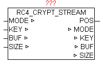

<!--
  Copyright (c) 2026 Hans Mühlbauer, Franz Höpfinger and others.

  This program and the accompanying materials are made available under the
  terms of the Eclipse Public License 2.0 which is available at
  https://www.eclipse.org/legal/epl-2.0

  SPDX-License-Identifier: EPL-2.0
-->

## RC4_CRYPT_STREAM

| | |
|:---|:---|
| **Type** | Function module |
| **I / O	MODE** | INT(mode: 1 = init / 2 = Data Block / 3 = Complete) |
| **KEY** | STRING(40) (320-bit long secret key) |
| **BUF** | ARRAY[0..63] OF BYTES (data block to process) |
| **SIZE** | UDINT (number of data) |
| **Output	POS** | UDINT(start address of the requested data block) |
| | The module  RC4_CRYPT_STREAM uses the RC4 data encryption to process an almost arbitrarily long data stream. This standard is used for example in an SSH, HTTPS, and WEP or WPA, and is thus widely used. The algorithm can in principle operate at up to 2048 bit key, but this is limited to the module on a 40-character key (but it can always be adjusted to up to 250 characters). Thus, it presents a key length of 320 bits, which are designed for applications on a PLC more than adequate. The maximum length of the stream is on this module is limited to 2^32 (4 gigabyte). The module can be used for encryption as well as to decrypt RC4 data. 64 bytes per cycle can still be processed, they will be processed in serial block mode. The data been encrypted or decrypted, remains in the module BUF for further processing, and must, of course, processed previously by the user before each new block of data. |

**Beispiel:**

Example: There are 2000 bytes in a buffer and are read using the file system in blocks. User sets mode is to 1 and SIZE to 2000. Calling the RC4_CRYPT_STREAM RC4_CRYPT_STREAM performs initialization and set MODE to 2 and passes at the POS the index (base 0) to the desired data. At SIZE the number of data, to be copied into the data memory BUF, is set . User copies the requested data in the BUF and calls the module RC4_CRYPT_STREAM repeatedly. This step is repeated until MODE remains at 2. If the RC4_CRYPT_STREAM has processed the last data block, this set MODE to 3.
