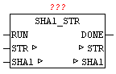

<!--
  Copyright (c) 2026 Hans Mühlbauer, Franz Höpfinger and others.

  This program and the accompanying materials are made available under the
  terms of the Eclipse Public License 2.0 which is available at
  https://www.eclipse.org/legal/epl-2.0

  SPDX-License-Identifier: EPL-2.0
-->

## SHA1_STR

| | |
|:---|:---|
| **Type** | Function module |
| **Input	RUN** | BOOL (Positive edge starts the calculation) |
| **Output	DONE** | BOOL (TRUE if calculations are complete) |
| **HASH** | ARRAY[0..19] OF BYTE (actual SHA1-HASH) |
| **I / O	STR** | STRING(string_length) (Text for HASH creation) |
| | With SHA1_STR the SHA1 hash can be calculated in a string. In the STR a string is passed to the module, and a positive edge at input "RUN", the calculation starts. DONE is immediately reset at startup, and after the process is DONE is set to TRUE. Then, at the parameter HASH the actual calculated HASH value is available. (See module SHA1-STREAM). |

**Beispiel:**

Example: Hash value of 'OSCAT' is 4fe4fa862f2e7b91bf95abe9f22831247a3afd35
