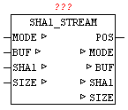

<!--
  Copyright (c) 2026 Hans Mühlbauer, Franz Höpfinger and others.

  This program and the accompanying materials are made available under the
  terms of the Eclipse Public License 2.0 which is available at
  https://www.eclipse.org/legal/epl-2.0

  SPDX-License-Identifier: EPL-2.0
-->

## Type	Function module

| | |
|:---|:---|
| **Output	POS** | UDINT(start address of the requested data block) |
| | The module SHA1_STREAM allows the calculation of standard cryptographic hash function SHA-1 (Secure Hash Algorithm). |
| | This can be created from any data stream a unique check value. It is virtually impossible to find two different messages with the same test value, this is referred to as collisions free. This can be used to check a configuration file for change or manipulation. |
| | With the secure hash algorithm (SHA1) a hash value is generated from 160 bits in length for any data. The maximum length of the stream is on this module is limited to 2^32 (4 gigabyte). The result is a 20-byte hash value, issued as ARRAY [0..19] OF BYTE. |

I / O	MODE: INT(mode: 1 = init / 2 = Data Block / 3 = Complete) BUF: ARRAY[0..63] OF BYTES (source data) SHA1: ARRAY [0..19] OF BYTE (current SHA1-HASH) SIZE: UDINT (number of data)

**Beispiel:**

Example: There are 2000 bytes in a buffer and are read using the file system in blocks. User sets MODE to 1 and SIZE to 2000. Calling the SHA1_STREAM SHA1_STREAM performs initialization and set MODE to 2 and passes at the POS the index (base 0) of the desired data. At SIZE the number of data, to be copied into the data memory BUF, is set . User copies the requested data in the BUF and calls the module SHA1_STREAM  repeatedly. This step is repeated until MODE remains at 2. [fzy] If the SHA1_STREAM has processed the last data block, this set MODE to 3. It can also happen that the last block, that at the SIZE length zero is set, therefore, so no data are copied into BUF . The current hash value can then be processed as a result. Example: Hash value of 'OSCAT' is 4fe4fa862f2e7b91bf95abe9f22831247a3afd35
