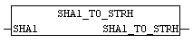

<!--
  Copyright (c) 2026 Hans Mühlbauer, Franz Höpfinger and others.

  This program and the accompanying materials are made available under the
  terms of the Eclipse Public License 2.0 which is available at
  https://www.eclipse.org/legal/epl-2.0

  SPDX-License-Identifier: EPL-2.0
-->

## Type	Function: STRING (40)

| | |
|:---|:---|
| **Input	MD5** | ARRAY[0..19] OF BYTE (SHA1 hash) |
| | The module converts the SHA1_TO_STRH SHA1 byte array to a hex string. |

