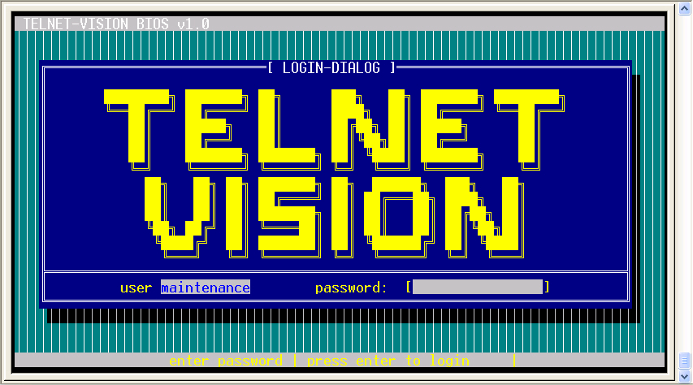
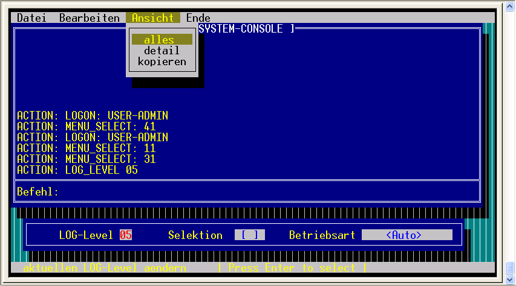
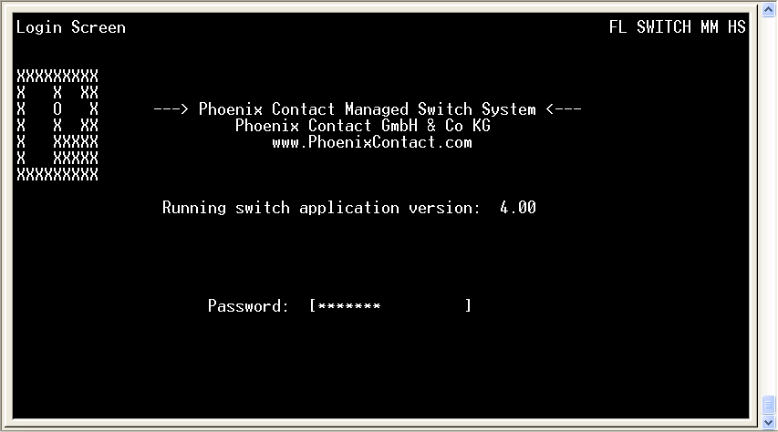
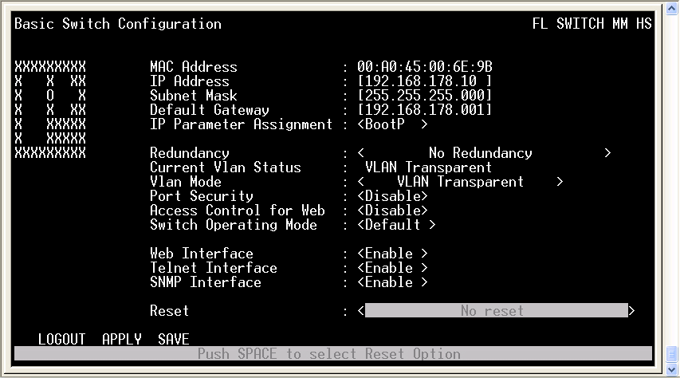

<!--
  Copyright (c) 2026 Hans Mühlbauer, Franz Höpfinger and others.

  This program and the accompanying materials are made available under the
  terms of the Eclipse Public License 2.0 which is available at
  https://www.eclipse.org/legal/epl-2.0

  SPDX-License-Identifier: EPL-2.0
-->

## TELNET_VISION

The package TELNET_VISION is a framework comprising a plurality of function modules to enable simple means with a graphical interface based on the standard TELNET. The GUI (Graphic User Interface) uses a screen of 80 characters wide and 24 lines down. At each coordinate (position) any displayable characters with selectable color attributes can be displayed. The horizontal axis (from left to right) is called standard with X, and includes the positions 00-79. The vertical axis (from top to bottom) is called by default to Y and includes the positions 00-23. For pure coordinates specify the location with X and Y. If an area (rectangle) are indicated, the upper-left corner and lower right corner X1/Y1 with X2, Y2 defined. The individual characters can be equipped with color attributes. A color attributes consist of a byte, where the left nibble (4 bits) the ink color (foreground color), and the right nibble (4 bits) the background color defines.

**Beispiel:**

Example: BYTE #16 #74, (* foreground: white, and blue background *) The following color attributes are defined: Foreground color: Background color: For easy handling of the package the module TN_FRAMEWORK is responsible, it must be called cyclically in the application, as it manages the whole system and executes it. This communication with the telnet client is processed, at graphic changes the system always made an intelligent automatic update. The INPUT_CONTROL items are stored, and the keystrokes to the respective elements forwarded, and even an optional menu bar is available. As this is a relatively complex interplay of many elements, in the library under / DEMO are two applications available, that perform with all the possibilities. It is to be advised at own projects to ocreate them based on these two templates to get as quickly as possible a working result, and to understand the interaction of the individual components and modules. The program  TN_VISION_DEMO_1  shows the following elements: Graphical representation of lines, polygons, texts, and associated shadow, and color scheme of the layout Representation of a Menu Bar Elements: EDIT_LINE (normal and hidden input), SELECT_POPUP, SELECT_TEXT TOOLTIP info line Illustration of a LOG_VIEWPORT with the message buffer, and navigation using keys. On the home page a LOGIN function is realized. By entering the password 'oscat' you can switch to the next page. The main page can be changed using the cursor up / down button and with tab between the individual elements. The menu can be called with the Escape key. The individual menu items are only for demonstration purposes, and lead to a log message. Only the menu item "end/LOGOUT" leads back to the home page. TN_VISION_DEMO_1 (screen page 1) TN_VISION_DEMO_1 (screen 2) The program  TN_VISION_DEMO_2  shows the following elements: Graphical representation of lines, polygons, texts and design the layout monchrome Elements: EDIT_LINE (normal and hidden input, and using an input mask), SELECT_TEXT TOOLTIP info line On the home page a LOGIN function is realized. By entering the password 'oscat' you can switch to the next page. The main page can be changed using the cursor up / down button and with tab between the individual elements. Only the item "LOGOUT" leads back to the home page. The two sides have shown a replica of the Telnet page of a  manageable switch from PHOENIX CONTACT, used to show that the TELNET VISION package can be used for for simple configuration pages. TN_VISION_DEMO_2 (screen page 1) TN_VISION_DEMO_2 (screen 2)

| Nibble | Color | Byte | Color |
| --- | --- | --- | --- |
| 0 | Black | 8 | Flashing Black |
| 1 | Light Red | 9 | Flashing Light Red |
| 2 | Light Green | 10 | Flashing Light Green |
| 3 | Yellow | 11 | Flashing Yellow |
| 4 | Light Blue | 12 | Flashing Light Blue |
| 5 | Pink / Light Magenta | 13 | Flashing Pink / Light Magenta |
| 6 | Light Cyan | 14 | Flashing Light Cyan |
| 7 | White | 15 | Flashing White |

| Nibble | Color |
| --- | --- |
| 0 | Black |
| 1 | Red |
| 2 | Green |
| 3 | Brown |
| 4 | Blue |
| 5 | Purple / Magenta |
| 6 | Cyan |
| 7 | Gray |
