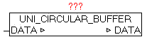

<!--
  Copyright (c) 2026 Hans Mühlbauer, Franz Höpfinger and others.

  This program and the accompanying materials are made available under the
  terms of the Eclipse Public License 2.0 which is available at
  https://www.eclipse.org/legal/epl-2.0

  SPDX-License-Identifier: EPL-2.0
-->

## UNI_CIRCULAR_BUFFER

| | |
|:---|:---|
| **Type	Function module** |  |
| **IN_OUT	DATA** | UNI_CIRCULAR_BUFFER_DATA (data storage) |
| | The module UNI_CIRCULAR_BUFFER is a ring buffer in the FIFO (first in - first out) principle, and can process any data as a byte stream. |
| | For this purpose, in the data structure  UNI_CIRCULAR_BUFFER_DATA all can be processed. |
| | The following commands are supported on DATA.D_MODE. |
| **01** | Element to write to buffer |
| **10** | Element of Buffer read but not to remove |
| **11** | The above command 10 read with item is removed. |
| **12** | read element from buffer and remove |
| **99** | Buffer is reset. All data is deleted |
| | With DATA.D_HEAD (WORD) in the right byte can be provided the element type, and in the left byte optional an additional user ID. |
| **D_HEAD =** | LEFT-BYTE (ADD-Ino), RIGHT-BYTE (Type ID) |
| **Type codes** |  |
| | 1 = STRING   (For DATA.D_STRING, the string must be provided) |
| **2 = REAL** | (For DATA.D_REAL, the REAL value is passed) |
| | 3 = DWORD   (  In the DWORD the DATA.D_DWORD must be passed) |
| | X = header information without data |
| | In DATA.BUF_SIZE the number of bytes output, to show the dropped items in total. With DATA.BUF_COUNT the number of in Buffer contained elements is provided. And on BUF_USED will issue the occupancy of the buffer as a percentage value. |
| | When an item is written in the buffer, and the required free space (memory) does not exist, after calling the module, the DATA.D_MODE remains unchanged. The command was successfu only if D_MODE   contains 0 after module call. |
| | When reading elements, the same operation is essential. |
| | Only if D_MODE subsequently is 0,  in D_HEAD the data type can be found, and if necessary, the data from D_STRING, D_REAL, D_DWORD can be read. After successful reading step, the deletion of the element to be performed with command 11. |

**Beispiel:**

Example: Writing element: DATA.D_MODE: = 1; (* command to write data *) DATA.D_HEAD: =  1; (* element-type = STRING *) DATA.D_STRING:= 'This is the text'; module-call() if DATA.D_MODE = 0, then the element was successfully saved Example: Reading element: DATA.D_MODE:= 10; (* read command * element) module-call() result DATA.D_HEAD =  1; (* Element-Type = STRING *) DATA.D_STRING = 'This is the text'; DATA.D_MODE = 0 Example: Delete element: DATA.D_MODE:= 11; (* command * delete item) module-call() DATA.D_MODE = 0; (* item was deleted *)
