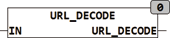

<!--
  Copyright (c) 2026 Hans Mühlbauer, Franz Höpfinger and others.

  This program and the accompanying materials are made available under the
  terms of the Eclipse Public License 2.0 which is available at
  https://www.eclipse.org/legal/epl-2.0

  SPDX-License-Identifier: EPL-2.0
-->

## URL_DECODE

| | |
|:---|:---|
| **Type	 Fu  FUNCTIONS** | STRING(string_length) |
| **Input	IN** | STRING (  String  ) |
| **Output** | STRING(string_length) (string) |
| | URL_DECODE converts the in %HH encoded special characters in the string IN in the appropriate ASCII code. In a URL encoding only the characters [A.. Z, a.. Z found, 0 .9, -._~] can occur. Other characters with a % character, followed by 2 characters long  Hexadecimal  of the character are shown. The reserved character '#' is encoded as a '%23'. |

