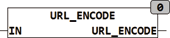

<!--
  Copyright (c) 2026 Hans Mühlbauer, Franz Höpfinger and others.

  This program and the accompanying materials are made available under the
  terms of the Eclipse Public License 2.0 which is available at
  https://www.eclipse.org/legal/epl-2.0

  SPDX-License-Identifier: EPL-2.0
-->

## URL_ENCODE

| | |
|:---|:---|
| **Type	 Function** | STRING(STRING_LENGTH) |
| **Input	IN** | STRING (  String  ) |
| **Output** | STRING  (STRING_LENGTH) (string) |
| | URL_ENCODE converts reserved characters in the string IN in the string '%HH'. In a URL encoding only the characters [A.. Z, a.. Z found, 0 .9, -._~] can occur. Other characters with a % sign followed by the two-character hexadecimal code of the character are shown. The reserved character '#' is encoded as a '%23'. |

