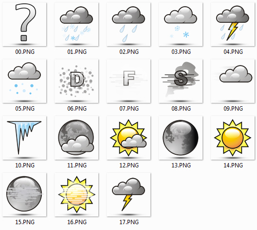
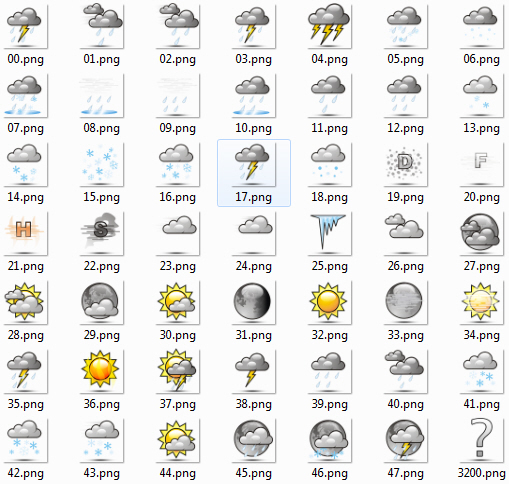
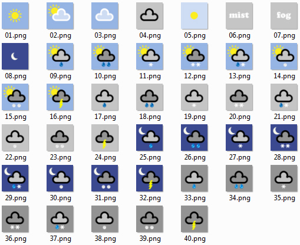

<!--
  Copyright (c) 2026 Hans Mühlbauer, Franz Höpfinger and others.

  This program and the accompanying materials are made available under the
  terms of the Eclipse Public License 2.0 which is available at
  https://www.eclipse.org/legal/epl-2.0

  SPDX-License-Identifier: EPL-2.0
-->

## VISU-WEATHER

| | |
|:---|:---|
| **SETUP** | WEATHER_OSCAT_1 |
| **SETUP** | WEATHER_YAHOO_1 |
| **SETUP** | WEATHER_WORLD_1 |

With the weather module the weather data in the corresponding data structures are provided. By default, each service provider delivers with its own code or weather weather icons. Since these differ in some totally, there are separate collections for each weather element. With the modules yahoo_weather_icon_oscat.odt
world_weather_icon_oscat.odt different weather icons and descriptive data can be reduced to a common denominator (OSCAT standard) so that a single ICON setup is sufficient.

