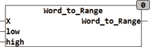

<!--
  Copyright (c) 2026 Hans Mühlbauer, Franz Höpfinger and others.

  This program and the accompanying materials are made available under the
  terms of the Eclipse Public License 2.0 which is available at
  https://www.eclipse.org/legal/epl-2.0

  SPDX-License-Identifier: EPL-2.0
-->

## Type	Function

| | |
|:---|:---|
| **Input	X** | WORD (input) |
| **LOW** | REAL (initial value at X = 0) |
| **HIGH** | REAL (initial value at X = 65535) |
| **Output** | REAL (output value) |
| | WORD_TO_RANGE converts a WORD value to a REAL value. An input value of 0 corresponds to the real value of LOW and an input value of 65535 corresponds to the input value of HIGH. |
| **To convert a WORD value of 0..65535 in a percentage of 0..100, the module is called as follows** |  |
| | WORD_TO_RANGE(X,100,0) |

