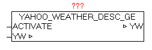

<!--
  Copyright (c) 2026 Hans Mühlbauer, Franz Höpfinger and others.

  This program and the accompanying materials are made available under the
  terms of the Eclipse Public License 2.0 which is available at
  https://www.eclipse.org/legal/epl-2.0

  SPDX-License-Identifier: EPL-2.0
-->

## YAHOO_WEATHER_DESC_DE

| | |
|:---|:---|
| **Type	Function module** |  |
| **IN_OUT	YW** | YAHOO_WEATHER_DATA   (Weather data) |
| **INPUT	ACTIVATE** | BOOL (positive edge starts the query) |
| | The module replaces the original English texts by German weather descriptions. Following a positive edge at ACTIVATE the elements (texts) in the YAHOO_WEATHER_DATA data structure is replaced. After querying the weather data using YAHOO_WEATHER this module should be called subsequently. It is simply the parameter DONE from the module YAHOO_WEATHER that is interconnected with ACTIVATE. |
| **The following elements will be adapted** |  |
| | YW.CUR_CONDITIONS_TEXT |
| | YW.FORCAST_TODAY_TEXT |
| | YW.FORCAST_TOMORROW_TEXT |

